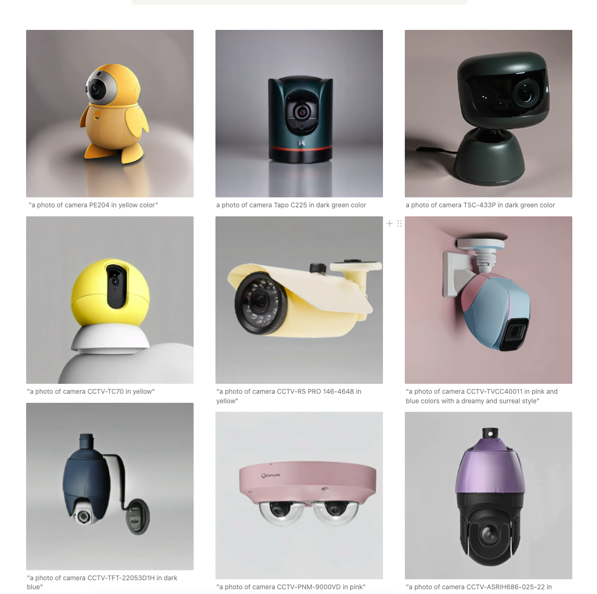

# Meta Human Demo
### Preparation
1. **Clone the Repository**

   ```bash
   git clone https://github.com/ariannaliu/metahuman-demo.git
   cd metahuman-demo
   ```
2. **Download the models from [Google Drive](https://drive.google.com/drive/folders/1QK7QHzr4PJQBIr3zJbCm9BG9iaH9MxhE?usp=sharing)**
   ```bash
   # unzip the files, put the folders of models under ./checkpoints
   # remove the files generated by mac zip (optional)
   metahuman-demo
   |
    ---checkpoints
      |
      |---camera
      |  |
      |   ---cctv1
      |  |
      |   ---cctv2   
      |
       ---human
         |
          ---ip-adapter-faceid_sdxl.bin
      
   ```


# Camera New Style Customization


## Installation

### Prerequisites

- [Anaconda](https://www.anaconda.com/products/individual) or [Miniconda](https://docs.conda.io/en/latest/miniconda.html)
- Python 3.10

### Steps

1. **Clone the Repository**

   ```bash
   git clone https://github.com/ariannaliu/metahuman-demo.git
   cd metahuman-demo
   # Download the model mention in the preparation part
   ```

2. **Create a Conda Environment**

   Create a new conda environment and install the required packages:

   ```bash
   conda create -n metahuman python=3.10
   conda activate metahuman
   pip install accelerate transformers safetensors diffusers datasets numpy scipy
   ```

## Usage

Navigate to the `src` directory and run the inference script with a prompt:

```bash
cd src
python3 inference.py --prompt "a photo of camera PE204 in pink color"
```

## Prompt Requirements

The prompt must contain one of the following cameras:

| Camera Models                  |
|--------------------------------|
| PE204                          |
| Tapo C225                      |
| TSC-433P                       |
| CCTV-TC70                      |
| CCTV-RS PRO 146-4648           |
| CCTV-TVCC40011                 |
| CCTV-TFT-22053D1H              |
| CCTV-PNM-9000VD                |
| CCTV-ASRIH686-025-22           |
| CCTV-PNM-9320VQP               |
| CCTV-PNM-9000VQ                |
| CCTV-DS-2CE56C0T-IRMMF         |
| CCTV-CD75-310-6527             |
| ADT CCTV                       |
| PTZ q6125le                    |
| PTZ-B51N_800                   |
| PTZ-TC-A3555                   |
| PTZ-HD20A                      |
| Tapo C110                      |

## Examples
 

# Metahuman Wearing Safety Equipment

This project leverages the [IP-Adapter](https://github.com/tencent-ailab/IP-Adapter) from Tencent AI Lab to generate images of metahumans wearing safety equipment based on a given input image and text prompt.


## Installation

### Prerequisites

- [Anaconda](https://www.anaconda.com/products/individual) or [Miniconda](https://docs.conda.io/en/latest/miniconda.html)
- Python 3.10

### Steps

1. **Clone the Repository**

   ```bash
   git clone https://github.com/ariannaliu/metahuman-demo.git
   cd metahuman-demo
   # Download the model mention in the preparation part
   ```

2. **Create a Conda Environment**

   ```bash
   conda create -n ip python=3.10
   conda activate ip
   ```

3. **Install Required Packages**

   ```bash
   pip install diffusers==0.22.1 accelerate transformers safetensors datasets numpy scipy insightface
   pip install git+https://github.com/tencent-ailab/IP-Adapter.git
   pip install onnxruntime einops
   ```

## Usage

To generate an image of a metahuman wearing safety equipment, run the following command:

```bash
cd src_human
python3 demo.py --image_path "1.png" --prompt "a man wearing yellow working uniform"
```

- `--image_path`: Path to the input image.
- `--prompt`: Text prompt describing the desired output.

## Examples

| Text Prompt                                       | Image 1                                                   | Image 2                                                   |
|---------------------------------------------------|------------------------------------------------------------|------------------------------------------------------------|
| A man wearing yellow working uniform              |                      |                      |
| A man with a blue safety vest and goggles         |                      |                      |
| The backview of a man wearing yellow working uniform |                      |                      |
| A man with a blue safety vest and goggles |                      |                      |


## Acknowledgements

- [IP-Adapter by Tencent AI Lab](https://github.com/tencent-ailab/IP-Adapter)
- [Diffusers Library by Hugging Face](https://github.com/huggingface/diffusers)
