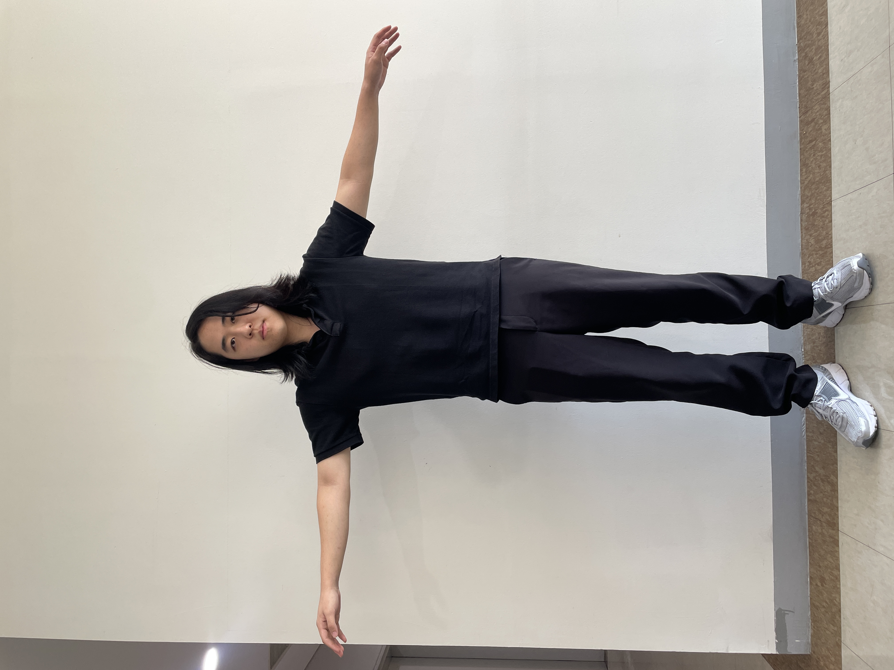
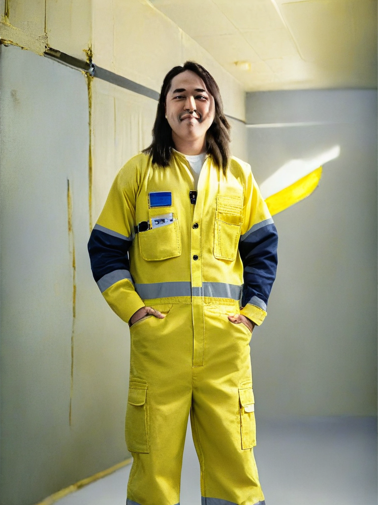
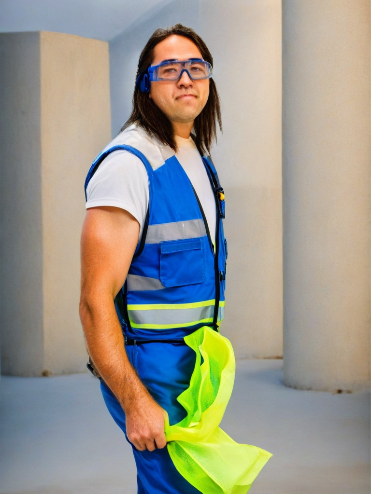
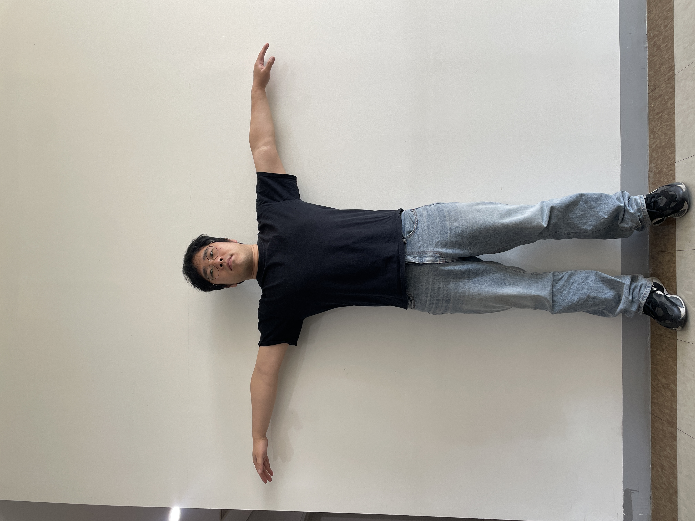
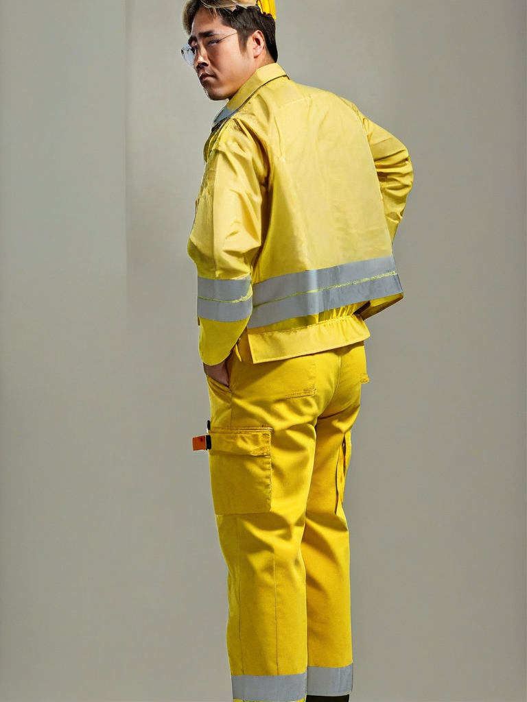
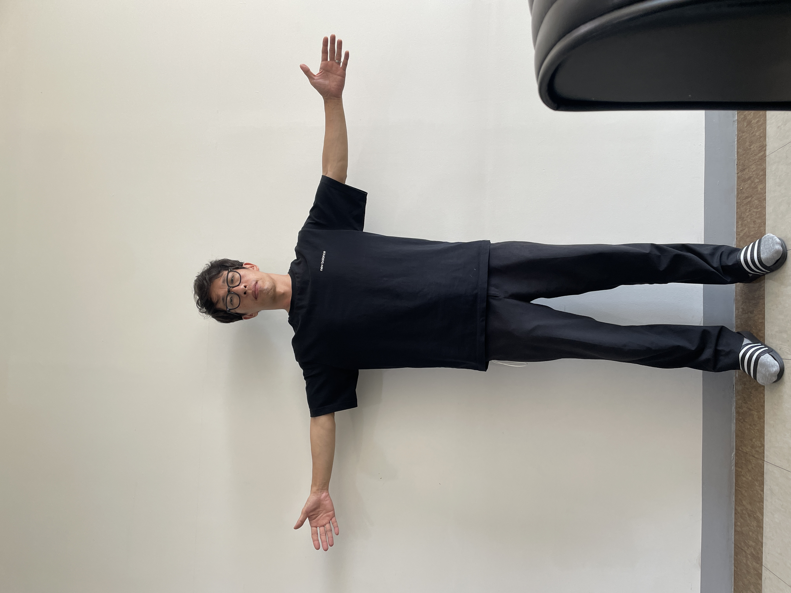
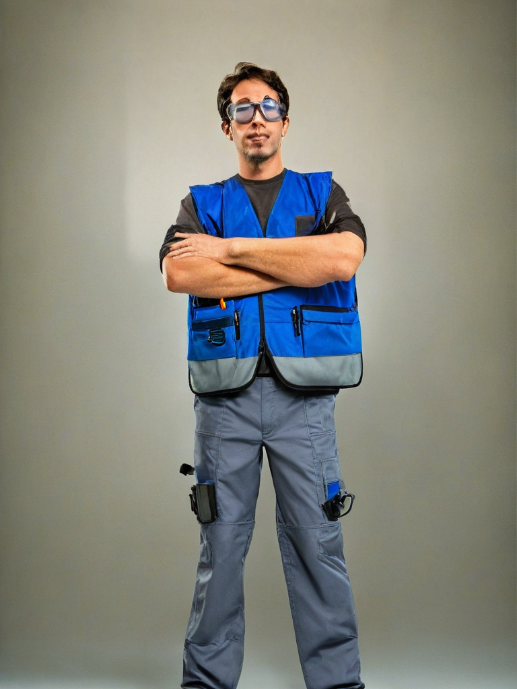

# Metahuman Wearing Safety Equipment

This project leverages the [IP-Adapter](https://github.com/tencent-ailab/IP-Adapter) from Tencent AI Lab to generate images of metahumans wearing safety equipment based on a given input image and text prompt.

## Table of Contents

- [Installation](#installation)
- [Usage](#usage)
- [Examples](#examples)
- [Acknowledgements](#acknowledgements)


## Installation

### Prerequisites

- [Anaconda](https://www.anaconda.com/products/individual) or [Miniconda](https://docs.conda.io/en/latest/miniconda.html)
- Python 3.10

### Steps

1. **Clone the Repository**

   ```bash
   git clone https://github.com/your_username/your_repository.git
   cd your_repository
   ```

2. **Create a Conda Environment**

   ```bash
   conda create -n ip python=3.10
   conda activate ip
   ```

3. **Install Required Packages**

   ```bash
   pip install diffusers==0.22.1 accelerate transformers safetensors datasets numpy scipy insightface
   pip install git+https://github.com/tencent-ailab/IP-Adapter.git
   pip install onnxruntime einops
   ```

## Usage

To generate an image of a metahuman wearing safety equipment, run the following command:

```bash
python3 demo.py --image_path "1.png" --prompt "a man wearing yellow working uniform"
```

- `--image_path`: Path to the input image.
- `--prompt`: Text prompt describing the desired output.

## Examples

| Text Prompt                                       | Image 1                                                   | Image 2                                                   |
|---------------------------------------------------|------------------------------------------------------------|------------------------------------------------------------|
| A man wearing yellow working uniform              |                      |                      |
| A man with a blue safety vest and goggles         |                      |                      |
| The backview of a man wearing yellow working uniform |                      |                      |
| A man with a blue safety vest and goggles |                      |                      |


## Acknowledgements

- [IP-Adapter by Tencent AI Lab](https://github.com/tencent-ailab/IP-Adapter)
- [Diffusers Library by Hugging Face](https://github.com/huggingface/diffusers)
